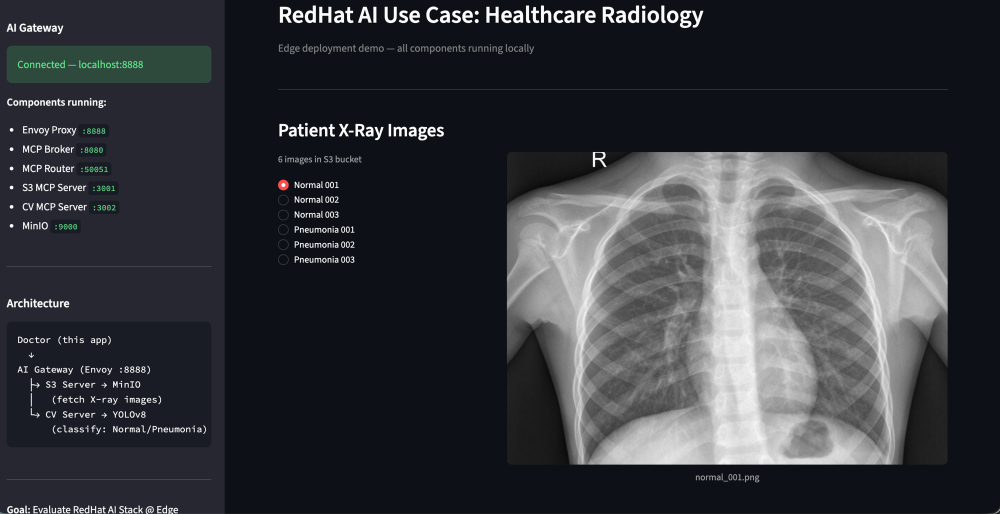
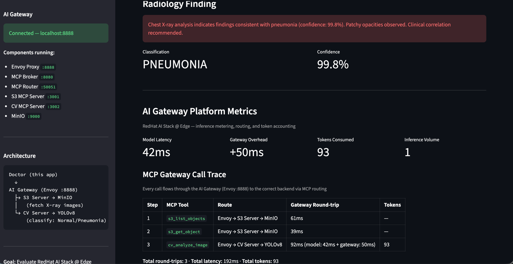

# Healthcare Radiology Edge Demo

A laptop-only version of the Red Hat AI Healthcare Radiology use case. A doctor selects a chest X-ray from S3 storage, the system routes it through an MCP Gateway to a CV inference backend, and returns a pneumonia screening result with a readable finding, confidence score, and token metering. Everything runs on localhost to demonstrate the Red Hat AI stack at the edge.

## Architecture

```
Doctor (Streamlit app)
  │
  ▼
AI Gateway (Envoy :8888)
  │── ext_proc ──▶ Router (:50051)     Parses MCP JSON-RPC, routes by tool prefix
  │
  ├── initialize / tools/list ──▶ Broker (:8080)          Aggregates tools from backends
  ├── tools/call s3_* ──────────▶ S3 MCP Server (:3001) ──▶ MinIO (:9000)
  └── tools/call cv_* ──────────▶ CV MCP Server (:3002) ──▶ YOLOv8 classifier
```

The MCP Gateway (Broker + Router) sits in front of two Python MCP servers. The Broker merges their tool lists under prefixed names (`s3_list_objects`, `s3_get_object`, `cv_analyze_image`). When a `tools/call` comes in, Envoy's ext_proc filter hands it to the Router, which rewrites the `:authority` header based on the tool prefix so Envoy routes to the correct backend.

## Screenshots

### Select a patient X-ray


### Classification result + AI Gateway platform metrics


## Demo flow

From the doctor's perspective, the workflow is 3 steps. Under the hood, each step is an MCP tool call routed through the AI Gateway:

1. **Browse images** -- `s3_list_objects` retrieves available chest X-rays from MinIO
2. **View X-ray** -- `s3_get_object` fetches the image for display
3. **Analyze** -- `cv_analyze_image` classifies the X-ray as NORMAL or PNEUMONIA, returns a textual finding with confidence score and token metering

The Streamlit demo app shows both the clinical result and the platform metrics (model latency, gateway overhead, MCP call trace, token consumption).

## Prerequisites

| Dependency | Version | Install |
|------------|---------|---------|
| macOS | Apple Silicon | -- |
| Python | 3.12.x | `brew install python@3.12` |
| Node.js | 22.7+ | `brew install node` (for MCP Inspector, optional) |
| Go | 1.26+ | `brew install go` |
| Envoy | 1.38+ | `brew install envoy` |
| MinIO | Latest | `brew install minio/stable/minio` |

## Quick Setup

```bash
git clone <repo-url> mcpgateway
cd mcpgateway

# Clone and build the MCP Gateway (sibling directory)
cd ..
git clone https://github.com/Kuadrant/mcp-gateway.git
cd mcp-gateway && go build -o bin/mcp-broker-router ./cmd/mcp-broker-router
cd ../mcpgateway

# One-command setup: checks prerequisites, creates venvs, installs deps, generates .env
bash setup.sh
```

`setup.sh` handles everything: prerequisite checks (Python 3.10+, Go, Envoy, MinIO), creating all three Python virtual environments, installing dependencies, generating `.env` from `.env.example` with a fresh signing key, and building the gateway binary if the source is available.

### Manual Setup

If you prefer to set things up step by step:

#### 1. Set up .env

Copy the template and generate a signing key:

```bash
cp .env.example .env
echo "GATEWAY_SIGNING_KEY=$(openssl rand -hex 32)" >> .env
```

#### 2. Set up Python environments

```bash
# S3 server
python3.12 -m venv servers/s3/.venv
servers/s3/.venv/bin/pip install -r servers/s3/requirements.txt

# CV server (pulls PyTorch + ultralytics, about 2GB)
python3.12 -m venv servers/cv/.venv
servers/cv/.venv/bin/pip install -r servers/cv/requirements.txt

# Streamlit demo app
python3.12 -m venv demo/.venv
demo/.venv/bin/pip install -r demo/requirements.txt
```

#### 3. Load sample X-rays into MinIO

```bash
minio server ~/minio-data &
servers/s3/.venv/bin/python servers/s3/setup_minio.py
```

Uploads 6 real chest X-ray images (3 normal, 3 pneumonia) from `data/samples/` into a `radiology-images` bucket.

## Running the demo

### Start all services

```bash
bash start-demo.sh
```

Starts MinIO, both MCP servers, the gateway, and Envoy. Waits for health checks and prints connection info when ready. If MinIO is already running, it skips that step.

### Launch the demo app

```bash
demo/.venv/bin/streamlit run demo/app.py
```

Opens the Streamlit UI at `http://localhost:8501`. Select a chest X-ray, click "Analyze this X-ray", and see:
- **Radiology Finding** -- readable classification result (Normal / Pneumonia) with confidence
- **AI Gateway Platform Metrics** -- model latency, gateway overhead, tokens consumed, inference volume
- **MCP Call Trace** -- each tool call's route through the gateway with timing breakdown

### MCP Inspector (optional)

For a lower-level view of the MCP protocol:

```bash
npx @modelcontextprotocol/inspector
```

1. Transport: Streamable HTTP
2. URL: `http://localhost:8888/mcp`
3. Connect, then call tools directly

### Automated E2E check

```bash
bash run-e2e.sh
```

Runs the full 5-step flow through Envoy and reports pass/fail with timing.

### Starting services individually

```bash
minio server ~/minio-data                                            # MinIO
servers/s3/.venv/bin/python servers/s3/server.py                     # S3 MCP Server
servers/cv/.venv/bin/python servers/cv/server.py                     # CV MCP Server
bash gateway/start-gateway.sh                                        # Gateway (Broker + Router)
bash gateway/start-envoy.sh                                          # Envoy
```

Each in its own terminal. Start them in this order -- the gateway needs both MCP servers running to discover tools.

## Project layout

```
mcpgateway/
├── servers/
│   ├── s3/
│   │   ├── server.py             # S3 MCP Server (list_objects, get_object)
│   │   ├── setup_minio.py        # bucket creation + image upload
│   │   └── requirements.txt
│   └── cv/
│       ├── server.py             # CV MCP Server (analyze_image, chest X-ray classifier)
│       ├── chest-xray-cls.pt     # YOLOv8n classification weights (Normal/Pneumonia)
│       └── requirements.txt
├── gateway/
│   ├── config.yaml               # server registrations (prefixes, hostnames)
│   ├── envoy.yaml                # Envoy proxy with ext_proc filter
│   ├── start-gateway.sh
│   ├── start-envoy.sh
│   ├── verify-gateway.sh         # test tool aggregation
│   └── verify-routing.sh         # test Envoy routing
├── demo/
│   ├── app.py                    # Streamlit demo app
│   └── requirements.txt
├── data/samples/                  # real chest X-ray PNGs (3 normal, 3 pneumonia)
├── setup.sh                       # one-command setup (venvs, deps, .env)
├── start-demo.sh                  # one-command startup for all services
├── run-e2e.sh                     # automated 5-step E2E verification
├── .env.example                   # template for .env (committed)
└── .env                           # MinIO credentials + gateway signing key (generated by setup.sh, not committed)
```

## Ports

| Service | Port |
|---------|------|
| MinIO | 9000 (API), 9001 (console) |
| S3 MCP Server | 3001 |
| CV MCP Server | 3002 |
| Broker | 8080 |
| Router (gRPC) | 50051 |
| Envoy (client-facing) | 8888 |
| Streamlit app | 8501 |

## Troubleshooting

**Port conflict on startup** -- `lsof -i :<port>` to find what's using it. Usually it's MinIO on 9000 from a previous session. `start-demo.sh` detects a running MinIO and skips it.

**Gateway returns empty tool list** -- The Broker discovers tools at startup. If the MCP servers weren't running yet, restart the gateway after they're up.

**421 Misdirected Request** -- The Python MCP SDK validates Host headers for DNS rebinding protection. The gateway hostnames (`s3.local`, `cv.local`) are configured in each server's `allowed_hosts`. If you see 421 after editing server code, check the `TransportSecuritySettings` block.

**High gateway overhead on first call** -- The Router initializes a session with each backend on first use (MCP handshake). Subsequent calls reuse the cached session and are faster.
